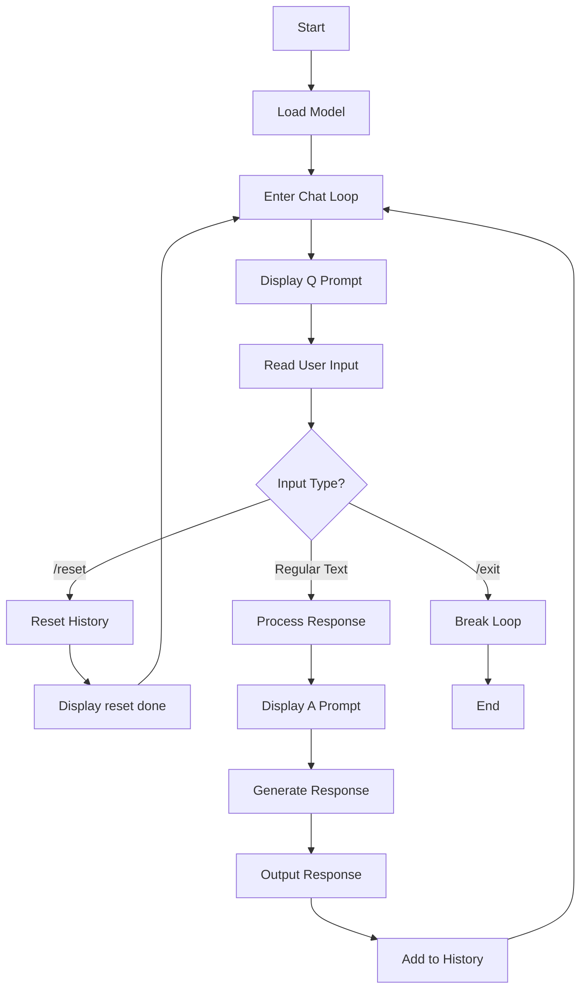

- mnn-llm使用流程

- 当输入常规文本时，cli_demo的业务流程如下：

    1. 文本处理: 对用户输入应用提示词模板
    2. Token编码: 使用分词器将文本转换为token ID序列
    3. 模型推理:
    - 预填充阶段(Prefill): 处理完整输入序列
    - 解码阶段(Decode): 逐个生成输出token
    4. KV缓存管理: 更新键值缓存状态
    5. 文本生成: 采样生成新token，直到达到最大长度或遇到停止符
    6. 结果输出: 实时流式输出生成的文本
    7. 历史记录更新: 将对话添加到历史记录中

  核心是通过Llm类的response()方法处理文本输入，经过编码、推理、解码最终生成回复。