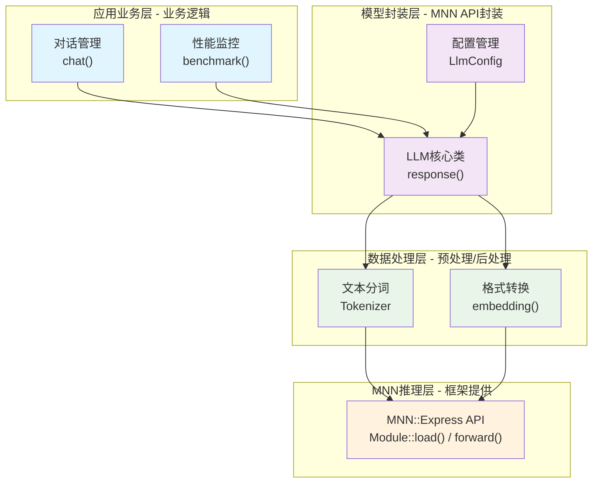
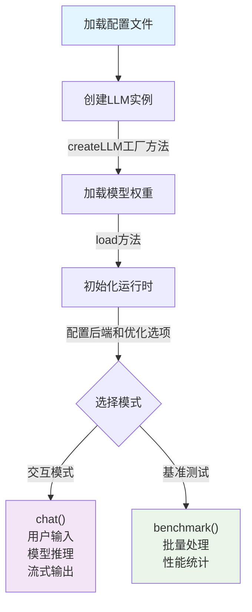

# 使用MNN部署大语言模型

## 1. 引言

正如英伟达的论文指出，[英伟达的论文](https://arxiv.org/html/2506.02153v1)在"代理型 AI"（Agentic AI）场景中，
Small Language Models（SLMs） 足够强大、运算合适且更加经济，因此比大型语言模型（LLMs）更适合作为未来趋势；
当需要通用对话能力时，则推荐 异构系统，即结合 SLM 与 LLM 的模块化系统，小型语言模型在实际应用中的巨大潜力。

阿里开源的MNN推理框架为我们提供了一个出色的解决方案。本文将基于 [mnn-llm](https://github.com/wangzhaode/mnn-llm) 这个使用MNN框架部署大语言模型的实际案例，深入分析如何使用MNN框架实现大语言模型的终端部署。

## 2. 使用MNN部署LLM的业务流程

### 2.1 核心业务架构

使用MNN部署大语言模型的核心是理解**业务流程**，主要包含四个层次：



> **备选显示方式**：在不支持Mermaid的平台上，可以使用以下表格形式：
> 
> | 层次 | 组件 | 职责 | 说明 |
> |------|------|------|------|
> | **应用业务层** | 对话管理 | `chat()` | 业务逻辑处理 |
> |  | 性能监控 | `benchmark()` | 性能统计分析 |
> | **模型封装层** | LLM核心类 | `response()` | MNN API封装 |
> |  | 配置管理 | `LlmConfig` | 参数配置管理 |
> | **数据处理层** | 文本分词 | `Tokenizer` | 预处理/后处理 |
> |  | 格式转换 | `embedding()` | 数据格式转换 |
> | **MNN推理层** | MNN Express API | `Module::load()` / `forward()` | 框架底层支持 |

### 2.2 MNN API的业务使用方式

#### 2.2.1 模型加载业务流程
```cpp
// 业务流程：配置 → 加载 → 初始化
class Llm {
    void load() {
        // Step 1: 获取模型路径
        auto model_path = config_->llm_model();
        
        // Step 2: 使用MNN加载模型
        modules_.emplace_back(Module::load({}, {}, model_path.c_str()));
        
        // Step 3: 初始化运行时
        init_runtime();
    }
};
```

#### 2.2.2 推理业务流程  
```cpp
// 业务流程：分词 → 嵌入 → 推理 → 解码
MNN::Express::VARP forward(const std::vector<int>& input_ids) {
    // Step 1: 转换为嵌入向量
    auto embeddings = embedding(input_ids);
    
    // Step 2: 生成注意力掩码
    auto mask = gen_attention_mask(input_ids.size());
    
    // Step 3: MNN模型推理
    auto output = forwardRaw(embeddings, mask, position_ids_);
    
    return output;
}
```

#### 2.2.3 对话业务流程
```cpp
// 业务流程：输入 → 处理 → 生成 → 输出
void response(const std::string& user_content) {
    // Step 1: 应用提示词模板
    auto prompt = apply_prompt_template(user_content);
    
    // Step 2: 文本分词
    auto input_ids = tokenizer_encode(prompt);
    
    // Step 3: 生成响应
    auto output_ids = generate(input_ids);
    
    // Step 4: 解码输出
    for(int id : output_ids) {
        std::cout << tokenizer_decode(id);
    }
}
```

## 3. 业务代码的核心职责

基于MNN框架，开发者的主要工作是实现**业务层逻辑**：

### 3.1 文本处理业务（`include/tokenizer.hpp`）

**业务职责**：处理用户输入文本，转换为模型可理解的token序列

```cpp
class Tokenizer {
public:
    // 核心业务接口
    std::vector<int> encode(const std::string& str);  // 文本 → token序列
    virtual std::string decode(int id) = 0;           // token → 文本
    
    // 业务辅助功能
    bool is_stop(int token);     // 判断停止符
    bool is_special(int token);  // 判断特殊符号
};

// 实际业务使用
auto input_ids = tokenizer_->encode("你好，请介绍一下MNN框架");
// input_ids = [101, 872, 1520, 8024, 6435, 5143, 5314, 671, 678, 77, 19666, 3903, 2155, 102]
```

### 3.2 配置管理业务（`src/llmconfig.hpp`）

**业务职责**：管理模型配置、推理参数、系统设置

```cpp
class LlmConfig {
public:
    // 模型文件业务配置
    std::string llm_model() const;    // 获取模型文件路径
    std::string llm_weight() const;   // 获取权重文件路径
    std::string tokenizer_file() const; // 获取分词器文件路径
    
    // 推理参数业务配置
    int max_new_tokens() const;       // 最大生成长度
    std::string backend_type() const; // 推理后端类型
    int thread_num() const;           // 线程数配置
    
    // 模型架构业务配置
    int hidden_size() const;          // 隐藏层维度
    int layer_nums() const;           // 层数
    std::string prompt_template() const; // 提示词模板
};
```

### 3.3 对话管理业务（`include/llm.hpp`）

**业务职责**：封装完整的对话流程，管理对话状态

```cpp
class Llm {
public:
    // 核心业务接口
    void response(const std::string& user_content);  // 处理用户输入
    void chat();                                     // 交互式对话
    std::vector<int> generate(const std::vector<int>& input_ids); // 文本生成
    
    // 业务状态管理
    const GenerateState& getState() const;          // 获取生成状态
    void reset();                                    // 重置对话状态
    
    // 业务工具方法
    std::string apply_prompt_template(const std::string& user_content) const;
    bool is_stop(int token_id);
    std::string tokenizer_decode(int id);
};
```

## 4. 完整的业务使用流程

### 4.1 步骤1：初始化业务环境
```cpp
// 1. 加载配置
std::shared_ptr<LlmConfig> config(new LlmConfig("./model/config.json"));

// 2. 创建LLM实例
std::unique_ptr<Llm> llm(Llm::createLLM("./model/"));

// 3. 加载模型到MNN
llm->load();
```

### 4.2 步骤2：处理业务请求
```cpp
// 交互式对话业务
llm->chat();  // 启动命令行对话

// 或单次请求业务
llm->response("请解释一下深度学习的原理");
```

### 4.3 步骤3：性能监控业务
```cpp
// 批量测试业务
void benchmark(Llm* llm, const std::vector<std::string>& prompts) {
    auto& state = llm->getState();
    
    for (const auto& prompt : prompts) {
        llm->response(prompt);
        
        // 收集业务指标
        int prompt_len = state.prompt_len_;
        int decode_len = state.gen_seq_len_;
        float prefill_speed = prompt_len / (state.prefill_us_ / 1e6);
        float decode_speed = decode_len / (state.decode_us_ / 1e6);
    }
}
```

## 5. CLI业务应用实现

### 5.1 主业务流程（`demo/cli_demo.cpp`）

```cpp
// 业务主流程：参数解析 → 模型加载 → 业务执行
int main(int argc, const char* argv[]) {
    // 业务参数解析
    if (argc < 2) {
        std::cout << "Usage: " << argv[0] << " model_dir <prompt.txt>" << std::endl;
        return 0;
    }
    
    // 业务初始化
    std::string model_dir = argv[1];
    std::unique_ptr<Llm> llm(Llm::createLLM(model_dir));
    llm->load();
    
    // 业务模式选择
    if (argc < 3) {
        llm->chat();  // 交互式对话业务
    } else {
        benchmark(llm.get(), argv[2]);  // 性能测试业务
    }
    
    return 0;
}
```

### 5.2 基准测试业务实现

```cpp
// 测试业务流程：读取 → 处理 → 统计 → 报告
void benchmark(Llm* llm, std::string prompt_file) {
    // 1. 读取测试数据
    std::ifstream prompt_fs(prompt_file);
    std::vector<std::string> prompts;
    std::string prompt;
    while (std::getline(prompt_fs, prompt)) {
        if (prompt.substr(0, 1) != "#") {  // 跳过注释
            prompts.push_back(prompt);
        }
    }
    
    // 2. 执行业务测试
    auto& state = llm->getState();
    int total_prompt_len = 0, total_decode_len = 0;
    int64_t total_prefill_time = 0, total_decode_time = 0;
    
    for (const auto& test_prompt : prompts) {
        llm->response(test_prompt);  // 执行业务逻辑
        
        // 收集业务指标
        total_prompt_len += state.prompt_len_;
        total_decode_len += state.gen_seq_len_;
        total_prefill_time += state.prefill_us_;
        total_decode_time += state.decode_us_;
    }
    
    // 3. 输出业务报告
    float prefill_s = total_prefill_time / 1e6;
    float decode_s = total_decode_time / 1e6;
    
    printf("=== 业务性能报告 ===\n");
    printf("处理提示词数量: %d\n", total_prompt_len);
    printf("生成回复数量: %d\n", total_decode_len);
    printf("预填充速度: %.2f tok/s\n", total_prompt_len / prefill_s);
    printf("生成速度: %.2f tok/s\n", total_decode_len / decode_s);
}
```

## 6. 使用MNN的核心价值

通过业务流程分析，MNN框架为LLM部署提供了：

**🔧 MNN框架提供**：
- 高效的神经网络推理引擎
- 跨平台的硬件适配（CPU/GPU/NPU）
- 内存和计算资源优化
- 模型加载和执行管理

**💼 开发者专注**：
- 业务逻辑设计（对话管理、用户交互）
- 数据预处理（分词、格式转换）
- 应用层优化（缓存策略、性能监控）
- 用户体验（命令行界面、流式输出）

这种分工让开发者可以**专注业务创新**，无需关心底层推理引擎的复杂实现。

## 7. 业务运行环境配置

### 7.1 运行参数配置

在业务使用中，主要需要关注的配置参数：

```cpp
// 业务配置管理
class LlmConfig {
    // 业务关心的核心配置
    int max_new_tokens() const;       // 控制生成长度
    int thread_num() const;           // 性能调节
    std::string prompt_template() const; // 对话模板
};

// 业务使用示例
auto config = std::make_shared<LlmConfig>("./model/config.json");
std::cout << "最大生成长度: " << config->max_new_tokens() << std::endl;
std::cout << "使用线程数: " << config->thread_num() << std::endl;
```

### 7.2 简单的启动流程

```bash
# 直接启动交互对话
./cli_demo ./model/

# 运行性能测试
./cli_demo ./model/ prompts.txt
```

业务代码自动处理模型加载、后端选择等底层细节，开发者只需关注业务逻辑实现。

## 8. 业务性能优化策略

基于MNN框架，业务层可以实现的优化策略：

### 8.1 KV缓存管理（`src/llm.cpp:42-71`）

KV缓存是Transformer模型推理优化的关键技术：

```cpp
// 位置: src/llm.cpp:42-71
struct KVMeta {
    size_t block = 4096;      ///< 内存块大小，默认4096字节
    size_t previous = 0;      ///< 之前的序列长度，记录历史token数量
    size_t remove = 0;        ///< 需要移除的token数量，用于缓存清理
    int* reserve = nullptr;   ///< 保留区域指针
    int n_reserve = 0;        ///< 保留区域数量
    size_t add = 0;           ///< 新增的token数量
    
    /**
     * @brief 同步缓存状态，更新序列长度并重置临时变量
     */
    void sync() {
        int revertNumber = 0;
        // 遍历保留区域，累计需要恢复的token数量
        for (int i=0; i<n_reserve; ++i) {
            revertNumber += reserve[2*i+1];
        }
        // 更新总的序列长度：之前的长度 - 移除数量 + 新增数量 + 恢复数量
        previous = previous - remove + add + revertNumber;
        // 重置临时状态变量
        n_reserve = 0; reserve = nullptr; remove = 0; add = 0;
    }
};
```

### 8.2 量化支持（`src/llm.cpp:77-96`）

MNN-LLM支持4位和8位量化以减少内存占用和计算复杂度：

```cpp
// 4位量化反量化函数 (src/llm.cpp:77-87)
static void q41_dequant_ref(const uint8_t* src, float* dst, float scale, float zero, int size) {
    for (int i = 0; i < size / 2; i++) {
        int x = src[i];         // 读取一个字节，包含两个4位数值
        int x1 = x / 16 - 8;    // 提取高4位并减去偏移量8
        int x2 = x % 16 - 8;    // 提取低4位并减去偏移量8
        float w1 = x1 * scale + zero;  // 反量化第一个值
        float w2 = x2 * scale + zero;  // 反量化第二个值
        dst[2 * i] = w1;        dst[2 * i + 1] = w2;
    }
}

// 8位量化反量化函数 (src/llm.cpp:91-96)
static void q81_dequant_ref(const uint8_t* src, float* dst, float scale, float zero, int size) {
    for (int i = 0; i < size; i++) {
        // 8位量化: 减去128（无符号转有符号），然后应用缩放和零点
        dst[i] = (src[i] - 128) * scale + zero;
    }
}
```

### 8.3 磁盘嵌入优化（`src/llm.cpp:99-228`）

磁盘嵌入类通过从磁盘按需加载词向量来节省内存：

```cpp
// 位置: src/llm.cpp:99-228
class DiskEmbedding {
private:
    std::unique_ptr<uint8_t[]> weight_;      ///< 权重数据缓冲区
    std::unique_ptr<uint8_t[]> alpha_;       ///< 量化参数缓冲区
    DequantFunction dequant_;                ///< 反量化函数指针
    int hidden_size_, quant_bit_, quant_block_, block_num_;
    size_t weight_token_size_, alpha_token_size_;
    
public:
    // 按需加载指定token的嵌入向量 (src/llm.cpp:180-228)
    void disk_embedding_lookup(const std::vector<int>& input_ids, float* dst) {
        if (quant_bit_ > 0) {
            // 量化模式：按块反量化
            for (size_t i = 0; i < input_ids.size(); i++) {
                int token = input_ids[i];
                seek_read(weight_.get(), weight_token_size_, w_offset_ + token * weight_token_size_);
                auto dptr = dst + i * hidden_size_;
                auto alpha_ptr = reinterpret_cast<float*>(alpha_.get()) + token * block_num_ * 2;
                
                // 按块进行反量化
                for (int n = 0; n < block_num_; n++) {
                    auto dst_ptr = dptr + n * quant_block_;
                    uint8_t* src_ptr = weight_.get() + n * (quant_block_ * quant_bit_ / 8);
                    float zero = (alpha_ptr + n * 2)[0];    // 零点参数
                    float scale = (alpha_ptr + n * 2)[1];   // 缩放因子参数
                    dequant_(src_ptr, dst_ptr, scale, zero, quant_block_);
                }
            }
        } else {
            // bf16模式：直接读取bf16数据
            for (size_t i = 0; i < input_ids.size(); i++) {
                seek_read(weight_.get(), weight_token_size_, input_ids[i] * weight_token_size_);
                // bf16到float转换逻辑...
            }
        }
    }
};
```

### 8.4 推理流程优化

CLI Demo的推理流程体现了MNN-LLM的高效设计：



### 8.5 多后端支持（`src/llm.cpp:387-396`）

```cpp
// 位置: src/llm.cpp:387-396
static MNNForwardType backend_type_convert(const std::string& type_str) {
    if (type_str == "cpu")    return MNN_FORWARD_CPU;      // CPU后端
    if (type_str == "metal")  return MNN_FORWARD_METAL;    // Metal后端（iOS/macOS GPU）
    if (type_str == "cuda")   return MNN_FORWARD_CUDA;     // CUDA后端（NVIDIA GPU）
    if (type_str == "opencl") return MNN_FORWARD_OPENCL;   // OpenCL后端（通用GPU）
    if (type_str == "vulkan") return MNN_FORWARD_VULKAN;   // Vulkan后端
    if (type_str == "npu")    return MNN_FORWARD_NN;       // NPU后端（神经处理单元）
    return MNN_FORWARD_AUTO;  // 自动选择后端
}
```

## 9. 多模态扩展

MNN-LLM支持多模态输入（图像、音频）：

```cpp
class Mllm : public Llm {
    // 视觉配置
    int image_height_ = 448;
    int vision_start_ = 151857;  // 视觉序列开始token
    int vision_end_ = 151858;    // 视觉序列结束token
    
    // 多模态处理方法
    std::vector<int> vision_process(const std::string& file);
    std::vector<int> audio_process(const std::string& file);
};
```

## 10. 实际应用场景

### 10.1 终端AI助手
- 低延迟响应
- 离线运行
- 隐私保护

### 10.2 边缘计算
- IoT设备部署
- 实时推理
- 资源受限环境

### 10.3 移动应用
- Android/iOS原生应用
- 本地知识问答
- 实时对话系统

## 11. 总结

MNN-LLM项目展示了如何使用MNN框架高效部署大语言模型。其关键优势包括：

1. **架构清晰**：分层设计，组件职责明确
2. **配置灵活**：支持多种模型和部署配置
3. **性能优异**：多重优化策略，适合资源受限环境
4. **扩展性强**：支持多模态，便于功能扩展
5. **跨平台**：支持多种操作系统和硬件后端

随着小型语言模型技术的发展，终端AI部署将成为未来的重要趋势。[mnn-llm](https://github.com/wangzhaode/mnn-llm) 项目为开发者提供了一个强大而实用的MNN框架使用案例，值得深入学习和应用。

---
*本文基于 [mnn-llm](https://github.com/wangzhaode/mnn-llm) 开源项目源码分析，该项目是使用MNN框架部署大语言模型的优秀实践案例*